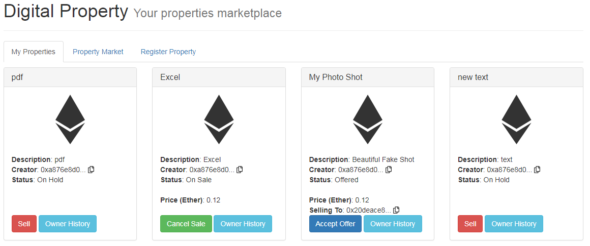

# PropertyStore_Ethereum
* adapt access code of minio and url of file API in app.js and minioClient.js
* install chrome extension: metamask, and create user and add ETH for yourself
    * MetaMask Ether Faucet: https://faucet.metamask.io/
* run `npm install` to install all required modules
* run `npm run dev` to start server hosting property store

Verified Smart Contract on Ropsten: https://ropsten.etherscan.io/address/0x913aa084653c1075a0291066541f5e3d28d6a329#code

THe whole application is live on: http://35.188.199.91/  right now.

